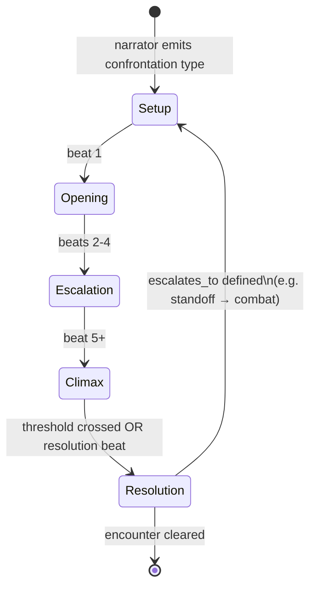
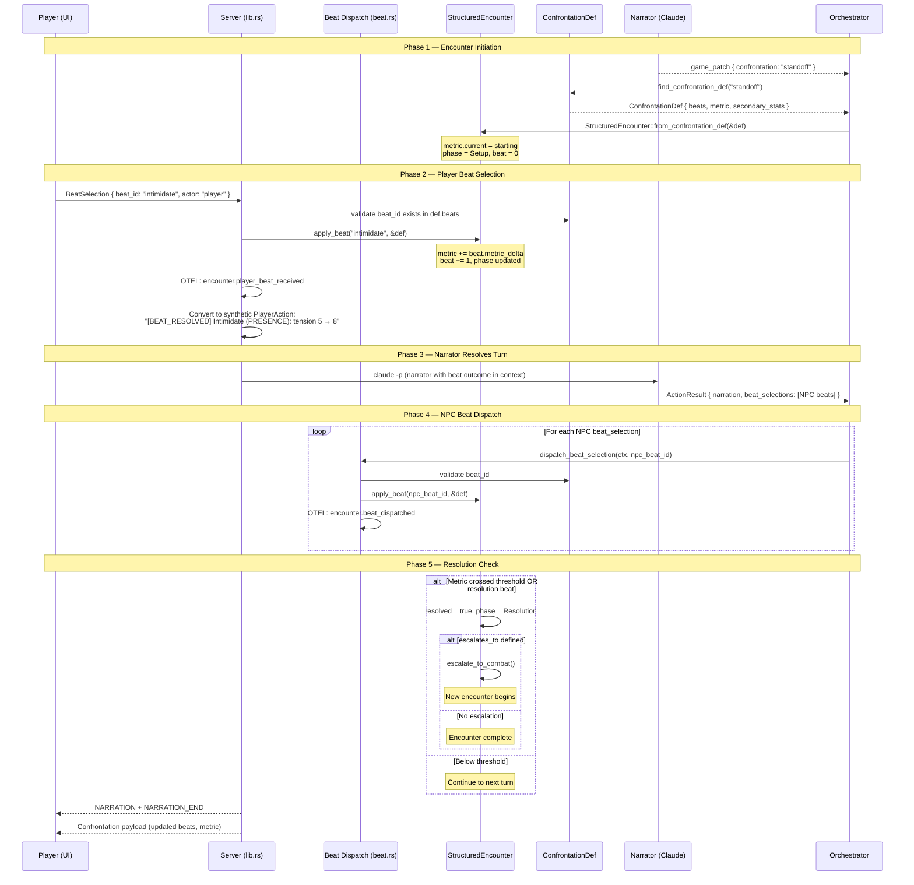
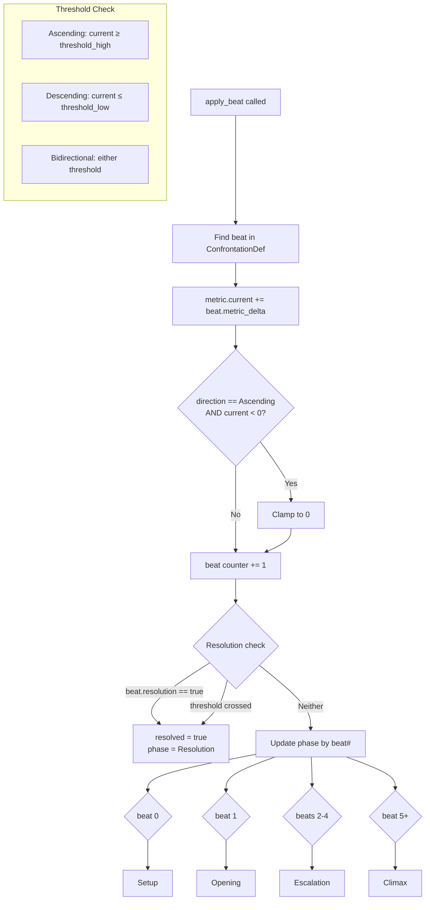
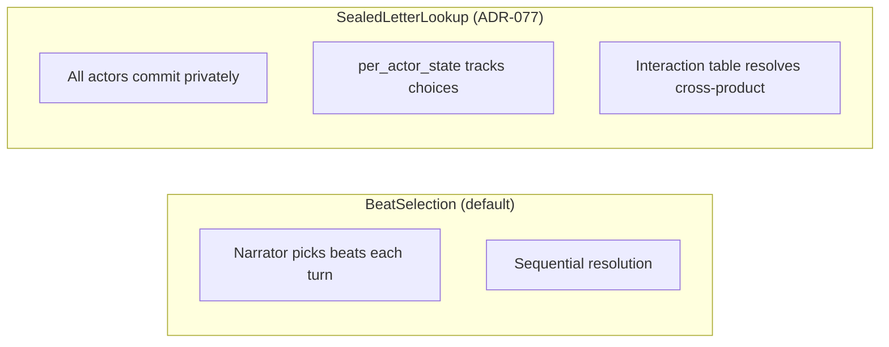
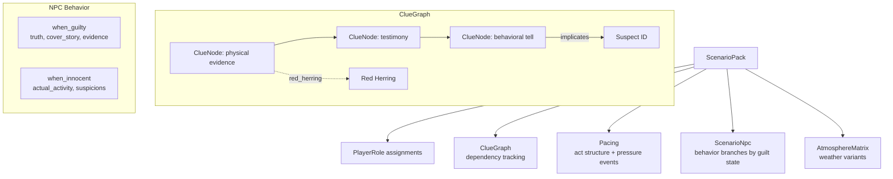

# Confrontations and Scenarios

> Genre-defined encounter engine with beat-based resolution and metric tracking.
> ConfrontationDefs in genre packs define available beats; StructuredEncounter tracks runtime state.

## Confrontation Lifecycle



## Beat Selection Sequence (BeatSelection mode)



## Beat Application Mechanics



## Resolution Modes (ADR-077)



**BeatSelection** is the standard mode — narrator emits beat choices and they're applied sequentially.

**SealedLetterLookup** is for simultaneous-commit encounters (dogfights, card games, duels) where secrecy matters. Each `EncounterActor` has `per_actor_state: HashMap<String, Value>` for tracking committed choices.

## ConfrontationDef Structure (genre pack rules.yaml)

```
ConfrontationDef
├── confrontation_type: "standoff"
├── label: "Tense Standoff"
├── category: "social" | "combat" | "pre_combat" | "movement"
├── resolution_mode: BeatSelection | SealedLetterLookup
├── metric: MetricDef
│   ├── name: "tension"
│   ├── direction: "ascending"
│   ├── starting: 0
│   ├── threshold_high: 10
│   └── threshold_low: null
├── beats: Vec<BeatDef>
│   ├── id: "intimidate"
│   ├── label: "Intimidate"
│   ├── metric_delta: +3
│   ├── stat_check: "PRESENCE"
│   ├── risk: "They might call your bluff"
│   ├── reveals: "Their true allegiance"
│   ├── resolution: false
│   ├── effect: "Target visibly shaken"
│   ├── narrator_hint: "Describe the power dynamic shifting"
│   └── gold_delta: null
├── secondary_stats: Vec<SecondaryStatDef>
├── escalates_to: "combat"
└── mood: "tension"
```

## Scenario System (Epic 7 — partial)

Scenarios are fully modeled in `sidequest-genre` but not yet wired into the orchestrator/dispatch loop.



**Not yet wired:** Clue discovery routing, accusation handling, NPC guilt branching, scenario event broadcasting.

## Key Files

| File | Purpose | LOC |
|------|---------|-----|
| `sidequest-genre/src/models/rules.rs` | ConfrontationDef, BeatDef, MetricDef, ResolutionMode | — |
| `sidequest-genre/src/models/scenario.rs` | ScenarioPack, ClueGraph, PlayerRole | — |
| `sidequest-game/src/encounter.rs` | StructuredEncounter, apply_beat(), EncounterPhase | 617 |
| `sidequest-server/src/dispatch/beat.rs` | dispatch_beat_selection() | 194 |
| `sidequest-server/src/dispatch/state_mutations.rs` | Post-resolution state changes | 436 |
| `sidequest-server/src/lib.rs` | BeatSelection message dispatch, validation | — |
| `sidequest-agents/src/orchestrator.rs` | BeatSelection in ActionResult, narrator context | 1,445 |

## OTEL Events

| Event | When |
|-------|------|
| `encounter.player_beat_received` | Player selects a beat (beat_id, metric before/after) |
| `encounter.beat_applied` | Beat applied to encounter (metric delta, phase) |
| `encounter.beat_dispatched` | NPC beat dispatched (stat_check, resolver) |
| `encounter.stat_check_resolved` | Stat check completed |
| `encounter.resolved` | Encounter resolved (beats_total, outcome) |
| `encounter.phase_transition` | Phase changed (old_phase, new_phase) |
| `encounter.escalation_started` | Encounter escalated (from_type, to_type) |
| `encounter.gold_delta` | Gold changed on resolution beat |
