# SideQuest — Wiring Diagrams

> End-to-end signal traces for every major feature. Each diagram shows the path from
> visible UI feature through server layers to storage, with file paths and function names.
>
> **Last updated:** 2026-03-30
> **Source of truth:** `sidequest-api/crates/` — traced from actual code, not design docs.

---

## Table of Contents

1. [Core Turn Loop](#1-core-turn-loop) — Action → Narration → State Delta
2. [Image Generation](#2-image-generation) — Narration → Subject → Beat Filter → Daemon → IMAGE
3. [TTS Voice Pipeline](#3-tts-voice-pipeline) — Narration → Segments → Kokoro → Audio Chunks
4. [Music & Audio](#4-music--audio) — Narration → Mood → Track Selection → AUDIO_CUE
5. [Multiplayer Turn Barrier](#5-multiplayer-turn-barrier) — Sealed Letter Collection → Resolution
6. [Combat Flow](#6-combat-flow) — Detection → State Machine → COMBAT_EVENT
7. [Character Creation](#7-character-creation) — Builder State Machine → Character
8. [Pacing & Drama Engine](#8-pacing--drama-engine) — TensionTracker → Delivery Mode → Prompt
9. [Knowledge Pipeline](#9-knowledge-pipeline) — Footnotes → KnownFacts → Lore → Prompt
10. [NPC Personality (OCEAN)](#10-npc-personality-ocean) — Profiles → Behavioral Summary → Prompt
11. [Faction Agendas & Scene Directives](#11-faction-agendas--scene-directives) — Agendas → Directives → Narrator
12. [Slash Commands](#12-slash-commands) — /command → Router → Response
13. [Trope Engine](#13-trope-engine) — Tick → Beat Firing → Narrator Injection
14. [Session Persistence](#14-session-persistence) — GameSnapshot → SQLite → Recovery
15. [Genre Pack Loading](#15-genre-pack-loading) — YAML → Typed Structs → Session State

---

## 1. Core Turn Loop

The central pipeline from player input to narrated response.

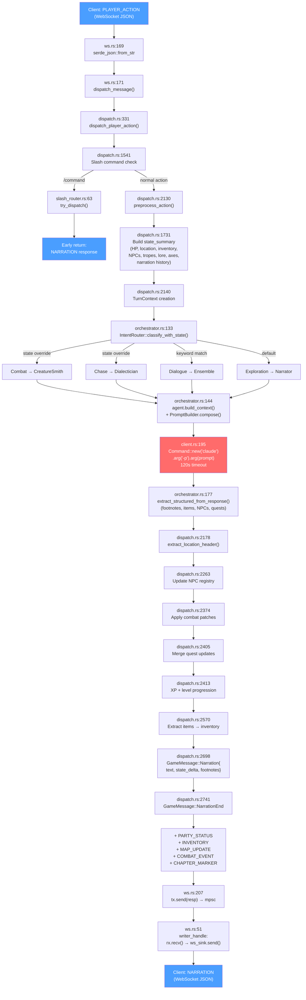

**Key files:** `ws.rs` → `dispatch.rs` (1950 LOC monolith) → `orchestrator.rs` → `client.rs` → back through `dispatch.rs`

**Storage touched:** NPC registry, quest log, inventory, XP/level, narration history, lore store

---

## 2. Image Generation

Background pipeline — narration triggers render, result arrives asynchronously.

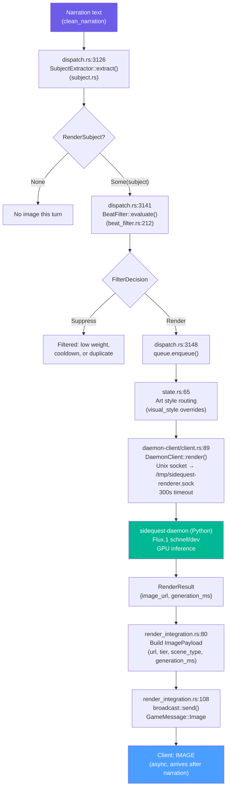

**Beat filter gates:** weight threshold, cooldown timer, burst rate, duplicate hash suppression

**Render tiers:** portrait, scene, landscape, abstract, text, cartography, tactical

---

## 3. TTS Voice Pipeline

Parallel to narration delivery — segments synthesized and streamed as audio chunks.

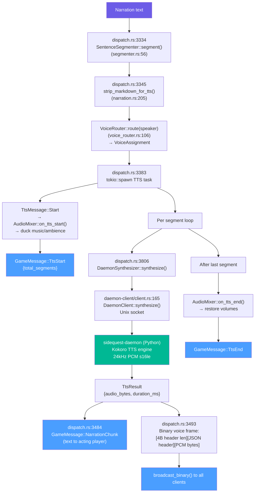

**Audio ducking:** Music and ambience volumes reduced during speech, restored after TTS_END

**Frame format:** `[uint32 header_len][JSON: {type, segment_id, sample_rate, format}][raw PCM]`

---

## 4. Music & Audio

Mood classification drives track selection with anti-repetition rotation.

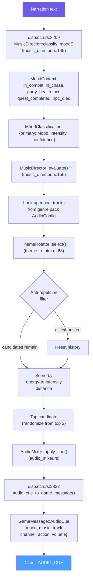

**Moods:** Combat, Exploration, Tension, Triumph, Sorrow, Mystery, Calm

**3 channels:** music, sfx, ambience — each with independent volume and action (play/fade_in/fade_out/duck/restore/stop)

**Rotation depth:** 3 tracks per mood before repeat allowed

---

## 5. Multiplayer Turn Barrier

Sealed letter pattern — all players submit, one handler resolves.

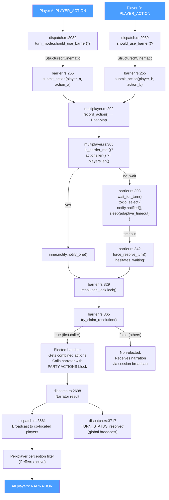

**Adaptive timeout:** 3s for 2-3 players, 5s for 4+ (configurable tiers)

**Resolution lock:** `Mutex` ensures exactly one tokio task calls the narrator — others receive broadcast

**Perception filter:** If a player has perceptual effects, their narration copy is prefixed with `[Your perception is altered: ...]`

---

## 6. Combat Flow

Intent-based and keyword-fallback detection, with state machine transitions.

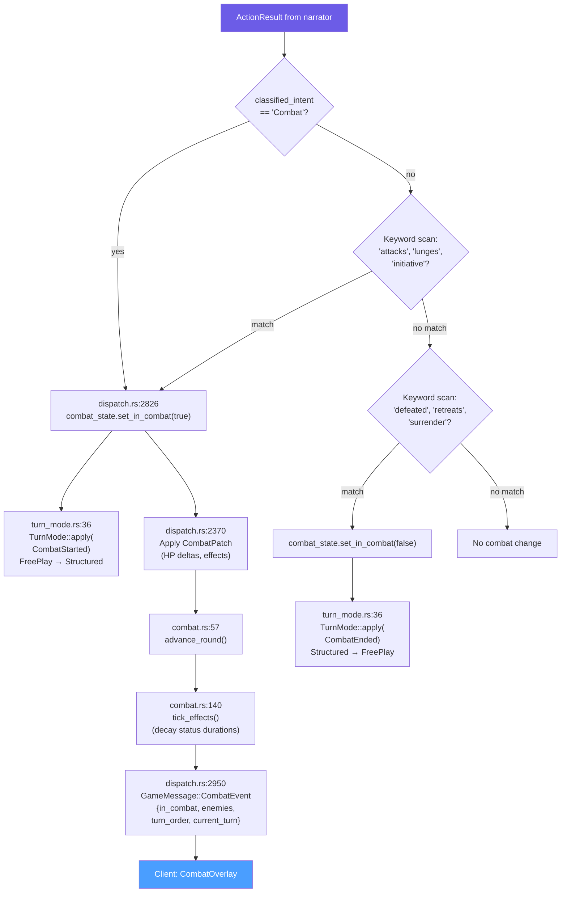

**Turn mode FSM:** `FreePlay` ↔ `Structured` (on combat start/end), `FreePlay` → `Cinematic` (on cutscene)

**CombatState tracks:** round counter, damage log, status effects (with duration decay), drama_weight

---

## 7. Character Creation

Genre-driven scene-based state machine with bidirectional messages.

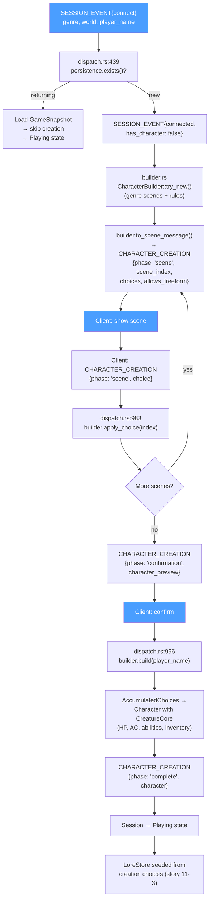

**Accumulated from scenes:** class, race, personality, items, affinity, backstory fragments, stat bonuses, pronouns, rig type, catch phrase

**3 creation modes (ADR-016):** Menu (pick from list), Guided (follow prompts), Freeform (describe anything)

---

## 8. Pacing & Drama Engine

Dual-track tension model drives narration length and delivery speed.

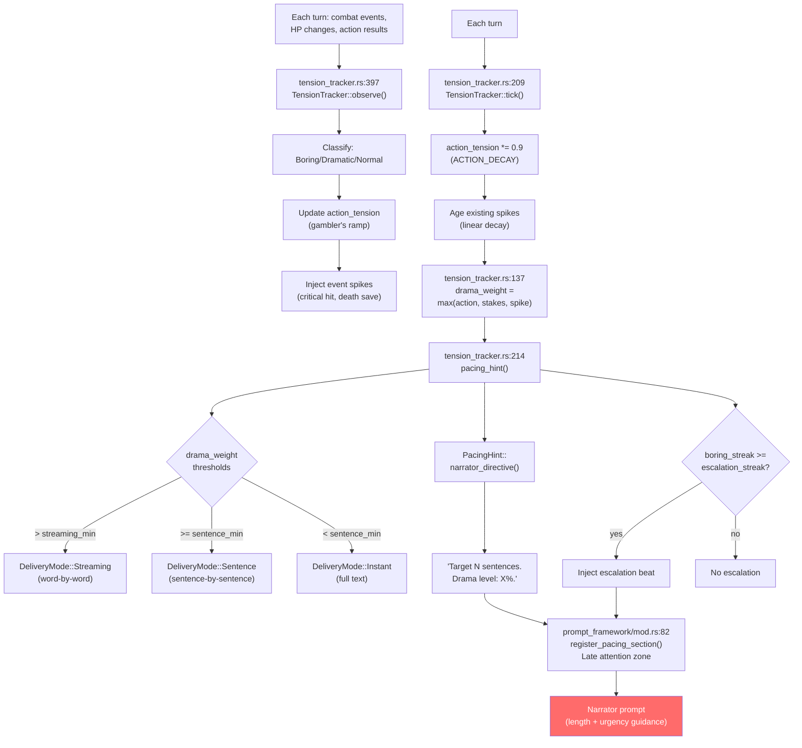

**Genre-tunable:** `pacing.yaml` in genre pack sets `streaming_delivery_min`, `sentence_delivery_min`, `escalation_streak`

**Dual tracks:** Action tension (gambler's ramp from boring streaks) + Stakes tension (HP ratio) + Event spikes (discrete dramatic moments)

---

## 9. Knowledge Pipeline

Narrator footnotes become persistent facts that feed back into future prompts.

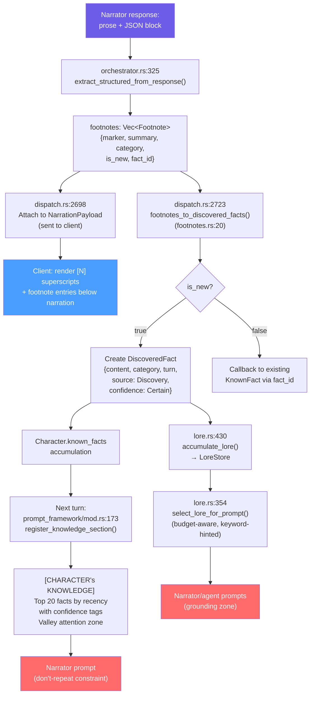

**FactCategory:** Lore, Place, Person, Quest, Ability

**Lore budget:** Token-aware selection prevents prompt bloat (content.len / 4 token estimate)

**Feedback loop:** Footnotes → KnownFacts → prompt injection → narrator avoids repeating → new footnotes

---

## 10. NPC Personality (OCEAN)

Big Five profiles loaded from genre packs, summarized into narrator prompts.

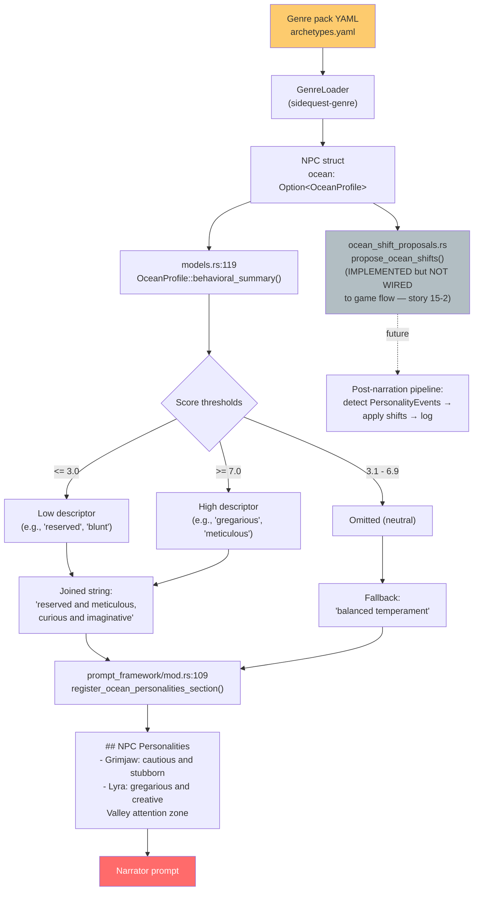

**5 dimensions:** Openness, Conscientiousness, Extraversion, Agreeableness, Neuroticism (0.0-10.0)

**Agreeableness → Disposition:** A-dimension feeds the existing -15 to +15 disposition system

**Gap:** OCEAN shift proposals are implemented but not wired into the game flow (Epic 15, story 15-2)

---

## 11. Faction Agendas & Scene Directives

Factions pursue goals that inject into every narrator turn.

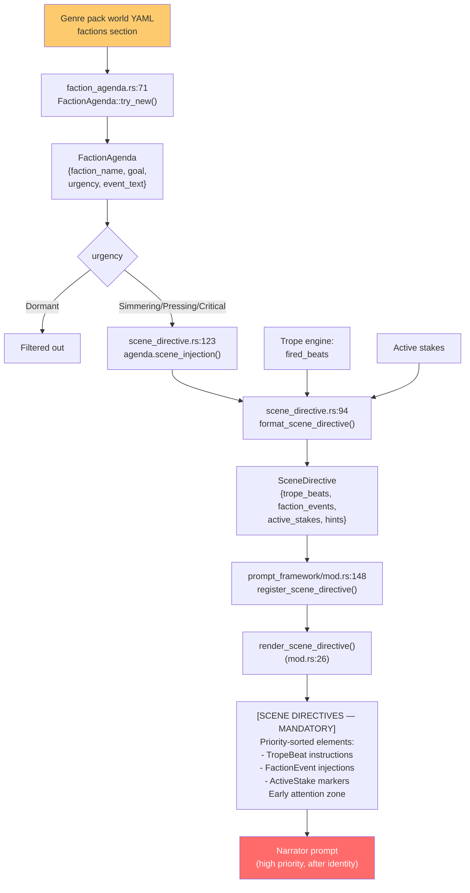

**Urgency levels:** Dormant (filtered), Simmering, Pressing, Critical

**Mandatory weave:** Scene directives use EARLY attention zone — narrator must incorporate them

---

## 12. Slash Commands

Server-side interception before intent classification.

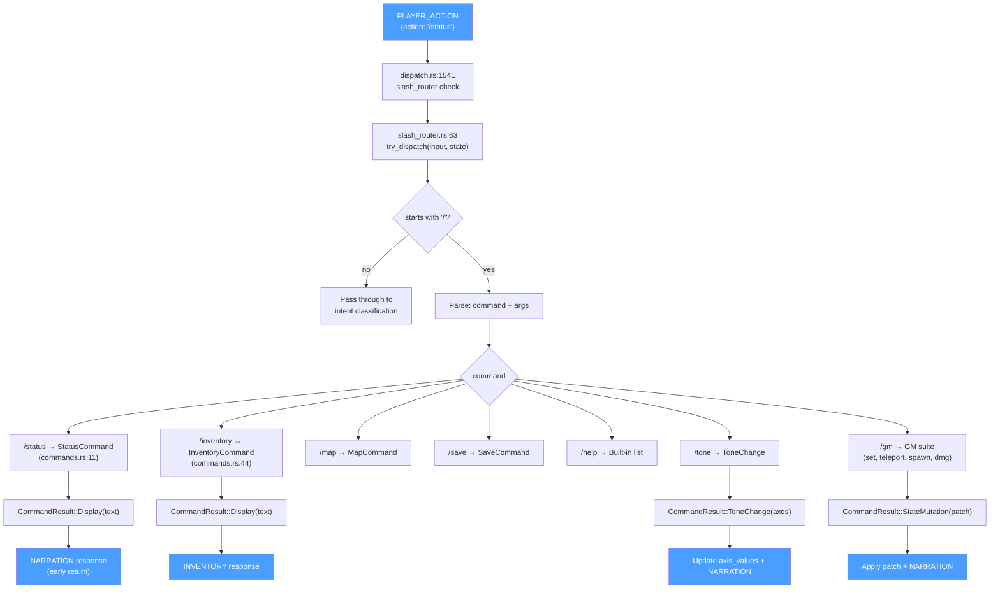

**No LLM call:** Slash commands resolve mechanically — no Claude subprocess, no intent classification

**GM commands:** Protected by role check, allow direct state manipulation for debugging

---

## 13. Trope Engine

Genre-defined narrative pacing via trope lifecycle and beat injection.

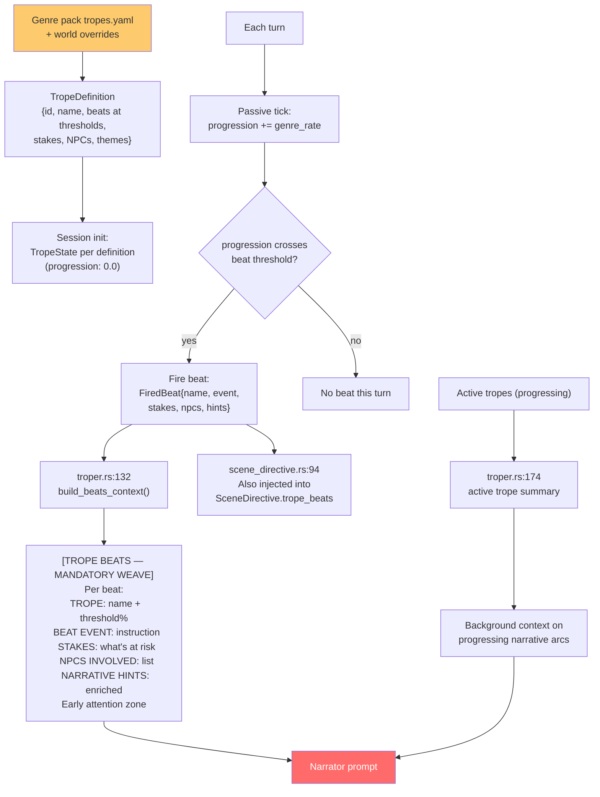

**Trope lifecycle:** Progression 0.0 → 1.0 with beats firing at defined thresholds

**Engagement multiplier:** Scale progression rate by player engagement (turns_since_meaningful)

---

## 14. Session Persistence

Atomic save after every turn, full recovery on reconnect.

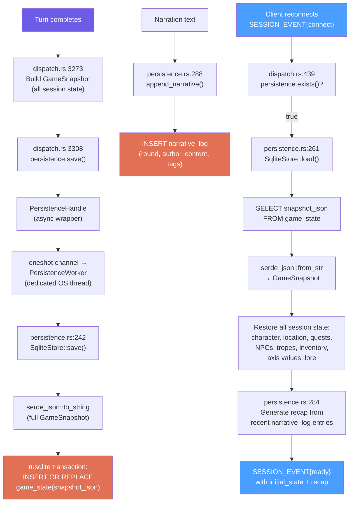

**Schema:** 3 tables — `session_meta`, `game_state` (single row, full JSON), `narrative_log` (append-only)

**Actor pattern:** `rusqlite::Connection` is `!Send` — wrapped in dedicated OS thread with mpsc command channel

**One DB per session:** `{save_dir}/{genre}/{world}/{player}/save.db`

**GameSnapshot includes:** characters, NPCs, combat, chase, tropes (full TropeState), quests, lore, axis values, achievements, campaign maturity, world history, NPC registry

---

## 15. Genre Pack Loading

Lazy binding — packs loaded per-session on connect, not at startup.

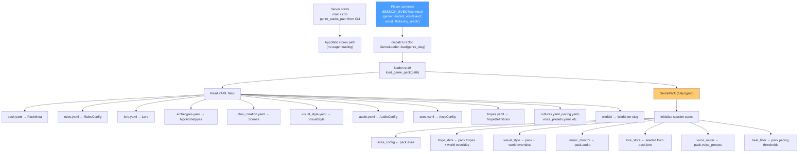

**15+ YAML files** per genre pack, all deserialized into typed Rust structs via serde_yaml

**World inheritance:** World-level overrides merge with genre-level defaults (tropes, visual style)

**Lazy binding (ADR-004):** Server starts genre-agnostic; genre bound at runtime on player connect

---

## Color Legend

```
Blue   (#4a9eff)  — Client/WebSocket messages (visible to player)
Purple (#6c5ce7)  — Internal data (narration text, results)
Red    (#ff6b6b)  — Claude CLI subprocess / narrator prompt
Green  (#00b894)  — Python daemon (Flux, Kokoro)
Orange (#e17055)  — SQLite persistence
Yellow (#fdcb6e)  — YAML configuration (genre packs)
Gray   (#b2bec3)  — Not yet wired / stub
```
